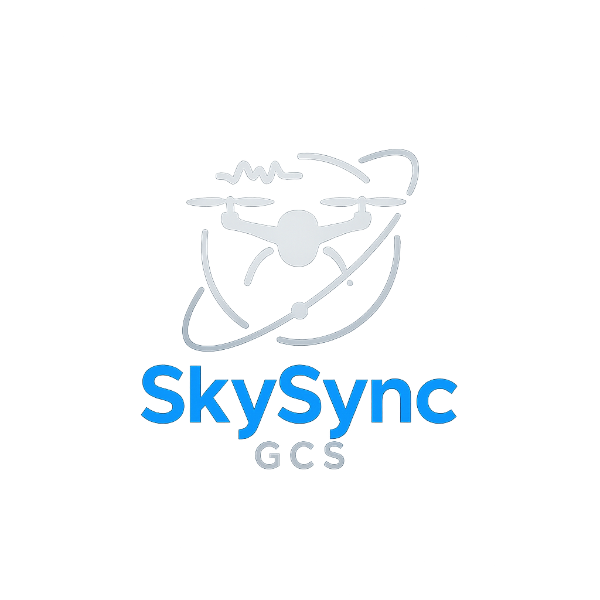

#  SkySync GCS

**Advanced Ground Control System for real-time drone telemetry, visualization, and calibration**

<p align="center">
  
</p>

## 🔥 Overview  
SkySync GCS is a powerful, modern ground control system designed for professional drone operations. Built for real-time data visualization and calibration using the MAVLink protocol, SkySync seamlessly integrates with Pixhawk and Jetson-based systems. Our platform features:

- **Immersive 3D Data Visualization** 📊  
- **Advanced TypeScript & React-based UI** 🎨  
- **Real-time MAVLink telemetry processing** ⏳  
- **Professional-grade sensor calibration** 🛰️  
- **Responsive design for all devices** 💻📱

<p align="center">
  
  
  
  
  
  
  
</p>

## 🌟 **Key Features**

- **Real-time Telemetry Dashboard**
  - Live battery status monitoring
  - GPS positioning with visual mapping
  - Attitude and orientation visualization
  - System health analytics

- **Professional Calibration Suite**
  - Gyroscope calibration
  - Accelerometer calibration
  - Magnetometer calibration
  - Level horizon calibration
  - Radio calibration

- **Advanced Visualization**
  - Interactive 3D drone model
  - Real-time attitude representation
  - Position tracking and history
  - Data-rich telemetry charts

- **Optimized Architecture**
  - Websocket-based communications
  - Efficient data processing
  - Modular component design
  - Cross-platform compatibility

---

## ⚙️ **System Architecture**

<p align="center">
  
</p>

### 🎯 **System Architecture**

#### 1️⃣ **Telemetry Data Pipeline**
- The SkySync backend utilizes Python-based MAVLink integration to capture real-time telemetry data
- Advanced data processing transforms raw MAVLink messages into structured JSON formats
- The frontend consumes this processed data through efficient pull/push mechanisms for real-time display
- Configurable data rates and filtering options optimize performance across different network conditions

#### 2️⃣ **Calibration Subsystem**
- WebSocket-based communication provides low-latency calibration command handling
- Bi-directional data flow enables real-time feedback during calibration procedures
- Step-by-step guided calibration workflow with visual indicators and progress tracking
- Support for all standard drone calibration procedures with advanced error detection

#### 3️⃣ **Frontend Architecture**
- Built with Next.js and React for optimal performance and SEO capabilities
- Three.js-powered 3D visualizations for immersive drone attitude representation
- Tailwind CSS implementation for responsive design across all device sizes
- Component-based architecture enabling easy customization and extension

#### 4️⃣ **Backend Infrastructure**
- Python-based microservices handling different aspects of drone communication
- Robust error handling and recovery mechanisms for connection disruptions
- Data persistence layer for telemetry logging and analysis
- Configurable communication parameters to support various drone hardware

## 🚀 **Getting Started**

### 📋 **Prerequisites**

- **Hardware Requirements**
  - Pixhawk-compatible flight controller
  - USB or telemetry connection to drone
  - Computer with internet connection
  
- **Software Requirements**
  - Node.js 16+ and npm/pnpm
  - Python 3.8+
  - MAVProxy (optional but recommended)

### 📌 **1. Installation**

```bash
# Clone the SkySync repository
git clone https://github.com/your-username/skysync-gcs.git
cd skysync-gcs

# Install frontend dependencies
pnpm install
# or with npm
npm install

# Install Python dependencies
pip install pymavlink websockets asyncio pyserial
```

### 🛠️ **2. Configuration**

Create a `.env.local` file in the project root:

```
NEXT_PUBLIC_WEBSOCKET_URL=ws://localhost:8765
NEXT_PUBLIC_MAVLINK_CONNECTION=/dev/tty.usbserial-XXXX
NEXT_PUBLIC_BAUD_RATE=57600
```

Adjust the serial port to match your system configuration:
- macOS: `/dev/tty.usbserial-XXXX`
- Linux: `/dev/ttyUSB0` or `/dev/ttyACM0`
- Windows: `COM3` (or other COM port)

### 🔌 **3. Connecting Your Drone**

For the best experience, we recommend using MAVProxy to create a UDP bridge:

```bash
# Start MAVProxy with UDP forwarding
mavproxy.py --master=/dev/tty.usbserial-XXXX --baud=57600 --out=udp:localhost:14550 --out=udp:localhost:14551
```

This allows multiple applications to communicate with your drone simultaneously.

### 🖥️ **4. Running the Application**

Start the backend services:

```bash
# Terminal 1: Start the telemetry listener
python3 listen.py --connection /dev/tty.usbserial-XXXX --baud 57600

# Terminal 2: Start the calibration server
python3 calibrating/calibration_server.py
```

Start the frontend development server:

```bash
# Terminal 3: Launch the web interface
pnpm dev
# or with npm
npm run dev
```

Navigate to `http://localhost:3000` in your browser to access the SkySync GCS interface.

## 📊 **Features & Capabilities**

### 📡 **Real-time Telemetry**

SkySync GCS provides comprehensive drone telemetry monitoring:

- **Attitude Data**: Real-time roll, pitch, yaw with 3D visualization
- **Position Tracking**: GPS coordinates with map overlay and flight path
- **System Health**: Battery status, signal strength, and system diagnostics
- **Sensor Data**: IMU readings, magnetometer data, and barometric information

### 🛠️ **Professional Calibration Suite**

The calibration interface guides you through each procedure with clear instructions:

1. **Gyroscope Calibration**
   - Automatically detects and corrects gyro bias
   - Visual indicators for calibration quality
   
2. **Accelerometer Calibration**
   - Six-position guided calibration workflow
   - Real-time feedback for each position
   
3. **Magnetometer Calibration**
   - Interactive compass calibration with visual guidance
   - Interference detection and correction
   
4. **Radio Calibration**
   - Channel mapping and endpoint configuration
   - Failsafe testing and configuration

### 📱 **Responsive Design**

SkySync GCS works seamlessly across all devices:

- **Desktop**: Full-featured interface with expanded data visualization
- **Tablet**: Optimized touch controls and readable data displays
- **Mobile**: Essential controls and telemetry for field operations

## 🚀 **Roadmap**

We're continuously improving SkySync GCS with new features:

- **Q3 2025**: Advanced mission planning with waypoint management
- **Q4 2025**: AI-powered anomaly detection for preventive maintenance
- **Q1 2026**: Enhanced 3D mapping with LiDAR and SLAM integration
- **Q2 2026**: Multi-vehicle control and fleet management capabilities

## 👨‍💻 **Contributing**

We welcome contributions to SkySync GCS:

1. Fork the repository
2. Create a feature branch (`git checkout -b feature/amazing-feature`)
3. Commit your changes (`git commit -m 'Add some amazing feature'`)
4. Push to the branch (`git push origin feature/amazing-feature`)
5. Open a Pull Request

## 📄 **License**

This project is licensed under the proprietary license. All rights reserved.

## 🤝 **Support & Contact**

For support, feature requests, or inquiries:

- **Website**: Upcoming       
- **Email**: arnav.angarkar20@gmail.com
- **Twitter**: Upcoming 
- **GitHub Issues**: For bug reports and feature requests

## 💫 **Technical Specifications**

### ⚡ **Performance**

SkySync GCS is optimized for real-time drone operations:

- **Update Rate**: Up to 50Hz telemetry updates
- **Latency**: <100ms typical end-to-end latency
- **Resource Usage**: <200MB memory footprint
- **Compatibility**: Works with MAVLink 1.0 and 2.0

### 🔌 **Connection Options**

Connect to your drone using multiple methods:

- **Serial Connection**: Direct USB to Pixhawk (FTDI)
- **Telemetry Radio**: Support for SiK radios (433/915MHz)
- **Wi-Fi**: ESP8266/ESP32-based telemetry bridges
- **Bluetooth**: Experimental support for HC-05/HC-06

### 📊 **Telemetry Parameters**

SkySync GCS monitors comprehensive drone metrics:

#### **Flight Data**
- **Attitude**: Roll, pitch, yaw (degrees and quaternions)
- **Position**: Latitude, longitude, altitude (GPS and barometric)
- **Velocity**: Ground speed and 3D velocity vector (m/s)
- **RC Input**: All channel values and control positions

#### **System Health**
- **Battery**: Voltage, current, remaining capacity, cells
- **Connection**: Signal strength, packet loss, round-trip time
- **System**: CPU usage, storage, temperature, uptime
- **Sensors**: Gyroscope, accelerometer, magnetometer, barometer health


<!-- ## 📸 **Screenshots**

<div align="center">
  <p><i>Main Dashboard - Real-time telemetry overview with 3D visualization</i></p>
  
  
  <p><i>Calibration Interface - Professional sensor calibration workflow</i></p>
  
  
  <p><i>Position Tracking - GPS-based position monitoring with map overlay</i></p>
  
</div> -->

## 🔧 **Quick Reference**

### Common Commands

```bash
# Start MAVProxy with UDP forwarding
mavproxy.py --master=/dev/tty.usbserial-XXXX --baud=57600 --out=udp:localhost:14550 --out=udp:localhost:14551

# Start the telemetry listener
python3 listen.py --connection /dev/tty.usbserial-XXXX --baud 57600

# Start the calibration server
python3 calibrating/calibration_server.py

# Start the web interface
pnpm dev  # or npm run dev
```

### System Requirements

- **Minimum Hardware**
  - 2 GHz dual-core processor
  - 4 GB RAM
  - 1 GB available storage
  - USB port for drone connection

- **Recommended Hardware**
  - 2.5 GHz quad-core processor
  - 8 GB RAM
  - 2 GB available storage
  - USB 3.0 port

- **Supported Operating Systems**
  - Windows 10/11
  - macOS 11+
  - Ubuntu 20.04+
  - Raspberry Pi OS (64-bit)

## 🙏 **Acknowledgments**

Special thanks to:
- ArduPilot Team for MAVLink protocol development
- QGroundControl and Mission Planner for inspiration

---

<p align="center">
  <b>SkySync GCS</b> - Professional Ground Control System<br>
  © 2025 Arnav Angarkar . All Rights Reserved.
</p>

### Prerequisites
1. Install Node.js (LTS version) from [nodejs.org](https://nodejs.org/)
2. Install Python 3.8+ from [python.org](https://python.org)
3. Install MAVProxy:
```bash
# On macOS
brew install mavproxy

# On Ubuntu/Debian
sudo apt-get install python3-pip python3-dev
pip3 install MAVProxy

# On Windows
pip install MAVProxy
```

### Step 1: Install Dependencies
```bash
# 1. Clone the repository
git clone https://github.com/ArnavBallinCode/Drone_Web_9009.git
cd Drone_Web_9009

# 2. Install Python dependencies
pip install pymavlink websockets asyncio pyserial

# 3. Install Node.js dependencies
npm install
# or if using pnpm
pnpm install
```

### Step 2: Connect Your Drone
1. Connect your Pixhawk/drone via USB
2. Identify the correct port:
```bash
# On macOS/Linux
ls /dev/tty.*
# Look for something like /dev/tty.usbserial-D30JKVZM

# On Windows
# Check Device Manager under "Ports (COM & LPT)"
# Look for something like COM3
```

### Step 3: Start the System

#### 1. Start MAVProxy (REQUIRED FIRST)
```bash
# On macOS/Linux
mavproxy.py --master=/dev/tty.usbserial-D30JKVZM --baud=57600 --out=udp:localhost:14550 --out=udp:localhost:14551

# On Windows
mavproxy.py --master=COM3 --baud=57600 --out=udp:localhost:14550 --out=udp:localhost:14551

# You should see:
# "Connecting to SITL on TCP port 5760"
# "Received heartbeat from APM"
```

#### 2. Start the Telemetry Listener
Open a new terminal and run:
```bash
# On macOS/Linux
python3 listen.py --connection /dev/tty.usbserial-D30JKVZM --baud 57600

# On Windows
python listen.py --connection COM3 --baud 57600

# You should see:
# "Connected to drone"
# "Writing telemetry data..."
```

#### 3. Start the Calibration Server
Open another new terminal and run:
```bash
# On macOS/Linux
python3 caliberating/calibration_server.py

# On Windows
python caliberating/calibration_server.py

# You should see:
# "Starting WebSocket server..."
# "Calibration WebSocket server started on ws://localhost:8765"
```

#### 4. Start the Web Interface
Open another new terminal and run:
```bash
# Using npm
npm run dev

# Using pnpm
pnpm dev

# You should see:
# "ready - started server on 0.0.0.0:3000"
```

### Step 4: Access the Interface
1. Open your browser and go to:
   - Main interface: http://localhost:3000
   - Calibration page: http://localhost:3000/calibration

### Calibration Instructions

1. **Gyroscope Calibration**
   - Keep the drone completely still on a level surface
   - Click "Start Gyro Calibration"
   - Wait for completion (about 30 seconds)

2. **Accelerometer Calibration**
   - Click "Start Accelerometer Calibration"
   - Follow the orientation instructions:
     1. Place vehicle level
     2. On right side
     3. On left side
     4. Nose down
     5. Nose up
     6. On its back
   - Hold each position until you see "Position detected"
   - Wait for "Position calibrated successfully" before moving to next position

3. **Magnetometer Calibration**
   - Click "Start Magnetometer Calibration"
   - Rotate the drone around all axes
   - Continue rotation for at least 30 seconds
   - Keep away from metal objects
   - Wait for completion message

4. **Barometer Calibration**
   - Keep the drone still
   - Click "Start Barometer Calibration"
   - Wait for completion (about 30 seconds)

### Troubleshooting

1. **No Serial Port Connection**
   ```bash
   # List all serial ports
   python3 -m serial.tools.list_ports
   ```

2. **MAVProxy Connection Issues**
   - Ensure no other program is using the serial port
   - Try different baud rates: 57600, 115200, 921600
   - Check USB connection

3. **Calibration Server Issues**
   - Ensure MAVProxy is running first
   - Check if port 8765 is free:
     ```bash
     # On macOS/Linux
     lsof -i :8765
     # On Windows
     netstat -ano | findstr :8765
     ```

4. **Web Interface Issues**
   - Clear browser cache
   - Check console for errors (F12)
   - Ensure all servers are running

### Port Reference
- MAVProxy UDP outputs: 14550, 14551
- Calibration WebSocket: 8765
- Web Interface: 3000 (or 3001)

### Command Summary
```bash
# All commands needed (in order):
mavproxy.py --master=/dev/tty.usbserial-D30JKVZM --baud=57600 --out=udp:localhost:14550 --out=udp:localhost:14551
python3 listen.py --connection /dev/tty.usbserial-D30JKVZM --baud 57600
python3 caliberating/calibration_server.py
pnpm dev  # or npm run dev
```

### System Requirements
- Python 3.8+
- Node.js 16+
- Modern web browser (Chrome, Firefox, Safari)
- USB port for drone connection
- 2GB RAM minimum
- 1GB free disk space

### File Structure
```
Drone_Web_9009/
├── caliberating/
│   └── calibration_server.py  # WebSocket calibration server
├── public/
│   └── params/               # Telemetry JSON files
├── app/
│   └── calibration/         # Calibration UI components
├── lib/
│   └── mavlink/            # MAVLink utilities
├── listen.py               # Telemetry listener
└── package.json           # Node.js dependencies
```

### PX4 vs ArduPilot Configuration

#### PX4-Specific Setup
1. **Connection Settings**
   ```bash
   # For PX4, use these MAVProxy settings:
   mavproxy.py --master=/dev/tty.usbserial-D30JKVZM --baud=921600 --out=udp:localhost:14550 --out=udp:localhost:14551
   ```
   Note: PX4 typically uses 921600 baud rate by default

2. **Calibration Commands**
   - PX4 uses slightly different calibration parameters:
     ```python
     # Gyroscope
     params = [1, 0, 0, 0, 0, 0, 0]  # Same as ArduPilot

     # Accelerometer
     params = [0, 0, 0, 0, 4, 0, 0]  # Note: Uses 4 instead of 1 for simple calibration

     # Magnetometer
     params = [0, 1, 0, 0, 0, 0, 0]  # Same as ArduPilot

     # Level Horizon
     params = [0, 0, 0, 0, 2, 0, 0]  # Note: Uses 2 for level calibration
     ```

3. **Status Messages**
   - PX4 uses different status message formats:
     - "[cal] progress <percentage>"
     - "[cal] orientation detected"
     - "[cal] calibration done: <sensor>"
     - "CAL FAILED" for failures

4. **Additional PX4 Parameters**
   ```bash
   # Set calibration auto-save (optional)
   param set CAL_AUTO_SAVE 1

   # Set QGC core as remote (recommended)
   param set MAV_COMP_ID 190
   param set MAV_SYS_ID 255
   ```

5. **Troubleshooting PX4**
   - If calibration fails immediately:
     ```bash
     # Check if the drone is armed
     # PX4 requires disarming for calibration
     commander disarm
     ```
   - If no messages appear:
     ```bash
     # Enable verbose output
     param set SYS_MC_EST_GROUP 2
     param set SENS_BOARD_ROT 0
     ```

### System Compatibility

Feature | ArduPilot | PX4
--------|-----------|-----
Default Baud Rate | 57600 | 921600
Calibration Messages | [cal] prefix | Various formats
Auto-save Calibration | Always | Configurable
Level Calibration | Part of Accel | Separate command
Simple Accel Cal | Value: 1 | Value: 4
Status Updates | Frequent | On state change
UDP Forwarding | Optional | Recommended

### Common PX4 Issues

1. **No Calibration Response**
   - Ensure drone is disarmed
   - Check parameter `CAL_AUTO_SAVE`
   - Verify `SYS_MC_EST_GROUP` setting

2. **Connection Issues**
   ```bash
   # For PX4, try these settings:
   mavproxy.py --master=/dev/tty.usbserial-D30JKVZM --baud=921600 --source-system=255 --source-component=190 --out=udp:localhost:14550 --out=udp:localhost:14551
   ```

3. **Calibration Timeouts**
   - PX4 may need longer timeouts:
     ```python
     CALIBRATION_TIMEOUT = 180  # Increase from 120 to 180 seconds
     ```

## 🔄 **Project Evolution: From Basic Web UI to 9009**  

### 🌟 **Previous Versions**  
- **Drone_Web_Interface_909:** Modern TypeScript/React/3D telemetry dashboard ([View Here](https://github.com/ArnavBallinCode/Drone_Web_Interface_909))
- **IROC_WEB_INTERFACE:** Original UI (HTML, CSS, JS) ([View Here](https://github.com/ArnavBallinCode/IROC_WEB_INTERFACE))
- **ISRO_IROC_Web:** Backend scripts (Python + MAVLink) ([View Here](https://github.com/ArnavBallinCode/ISRO_IROC_Web))
- **ISRO_IROC_Webinterface:** Older telemetry interface (Python-based) ([View Here](https://github.com/ArnavBallinCode/ISRO_IROC_Webinterface))