#  SkySync GCS

**Advanced Ground Control System for real-time drone telemetry, visualization, and calibration**

<p align="center">
  
</p>

## 🔥 Overview  
SkySync GCS is a powerful, modern ground control system designed for professional drone operations. Built for real-time data visualization and calibration using the MAVLink protocol, SkySync seamlessly integrates with Pixhawk and Jetson-based systems. Our platform features:

- **Immersive 3D Data Visualization** 📊  
- **Advanced TypeScript & React-based UI** 🎨  
- **Real-time MAVLink telemetry processing** ⏳  
- **Professional-grade sensor calibration** 🛰️  
- **Responsive design for all devices** 💻📱

<p align="center">
  
  
  
  
  
  
  
</p>

## 🌟 **Key Features**

- **Real-time Telemetry Dashboard**
  - Live battery status monitoring
  - GPS positioning with visual mapping
  - Attitude and orientation visualization
  - System health analytics

- **🛡️ Dynamic Drone Arena Visualization**
  - **Complete dynamic system** - No hardcoded coordinates
  - **Real-time SCP data fetching** from Jetson device
  - **Dynamic arena boundaries** from GPS coordinates
  - **Live safe spot detection** with pulsing animations
  - **Auto-refresh every 30 seconds** from Jetson device
  - **GPS-to-field coordinate conversion** system
  - **Real-time drone position tracking** with trail effects
  - **Safe spot proximity alerts** with distance calculations

- **Professional Calibration Suite**
  - Gyroscope calibration
  - Accelerometer calibration
  - Magnetometer calibration
  - Level horizon calibration
  - Radio calibration

- **Advanced Visualization**
  - Interactive 3D drone model
  - Real-time attitude representation
  - Position tracking and history
  - Data-rich telemetry charts

- **Optimized Architecture**
  - Websocket-based communications
  - Efficient data processing
  - Modular component design
  - Cross-platform compatibility

---

## ⚙️ **System Architecture**

<p align="center">
  
</p>

### 🎯 **System Architecture**

#### 1️⃣ **Telemetry Data Pipeline**
- The SkySync backend utilizes Python-based MAVLink integration to capture real-time telemetry data
- Advanced data processing transforms raw MAVLink messages into structured JSON formats
- The frontend consumes this processed data through efficient pull/push mechanisms for real-time display
- Configurable data rates and filtering options optimize performance across different network conditions

#### 2️⃣ **Calibration Subsystem**
- WebSocket-based communication provides low-latency calibration command handling
- Bi-directional data flow enables real-time feedback during calibration procedures
- Step-by-step guided calibration workflow with visual indicators and progress tracking
- Support for all standard drone calibration procedures with advanced error detection

#### 3️⃣ **Frontend Architecture**
- Built with Next.js and React for optimal performance and SEO capabilities
- Three.js-powered 3D visualizations for immersive drone attitude representation
- Tailwind CSS implementation for responsive design across all device sizes
- Component-based architecture enabling easy customization and extension

#### 4️⃣ **Backend Infrastructure**
- Python-based microservices handling different aspects of drone communication
- Robust error handling and recovery mechanisms for connection disruptions
- Data persistence layer for telemetry logging and analysis
- Configurable communication parameters to support various drone hardware

## 🚀 **Getting Started**

### 📋 **Prerequisites**

- **Hardware Requirements**
  - Pixhawk-compatible flight controller
  - USB or telemetry connection to drone
  - Computer with internet connection
  
- **Software Requirements**
  - Node.js 16+ and npm/pnpm
  - Python 3.8+
  - MAVProxy (optional but recommended)

### 📌 **1. Installation**

```bash
# Clone the SkySync repository
git clone https://github.com/your-username/skysync-gcs.git
cd skysync-gcs

# Install frontend dependencies
pnpm install
# or with npm
npm install

# Install Python dependencies
pip install pymavlink websockets asyncio pyserial
```

### 🛠️ **2. Configuration**

Create a `.env.local` file in the project root:

```
NEXT_PUBLIC_WEBSOCKET_URL=ws://localhost:8765
NEXT_PUBLIC_MAVLINK_CONNECTION=/dev/tty.usbserial-XXXX
NEXT_PUBLIC_BAUD_RATE=57600
```

Adjust the serial port to match your system configuration:
- macOS: `/dev/tty.usbserial-XXXX`
- Linux: `/dev/ttyUSB0` or `/dev/ttyACM0`
- Windows: `COM3` (or other COM port)

### 🔌 **3. Connecting Your Drone**

**IMPORTANT**: We use MAVProxy as a bridge to avoid port conflicts between multiple applications:


**Setup Commands:**
```bash
# Terminal 1: Start MAVProxy with UDP forwarding (REQUIRED FIRST)
mavproxy.py --master=/dev/tty.usbserial-XXXX --baud=115200 --out=udp:localhost:14550 --out=udp:localhost:14551 --console

# You should see:
# "Connecting to /dev/tty.usbserial-XXXX"
# "Received heartbeat from APM"
```

### 🖥️ **4. Running the Complete System**

**Data Flow Architecture:**


**Start all services in order:**

```bash
# Terminal 1: MAVProxy (Hardware Bridge)
mavproxy.py --master=/dev/tty.usbserial-XXXX --baud=115200 --out=udp:localhost:14550 --console

# Terminal 2: Telemetry Listener (via UDP)
python3 listen.py --connection=udp:localhost:14550

# Terminal 3: Calibration Server
python3 calibrating/calibration_server.py

# Terminal 4: Next.js Web Interface
npm run dev
```

**System Status Check:**
```bash
# Verify MAVProxy connection
# Should show: "heartbeat from system X component Y"

# Check JSON files being created
ls -la public/params/
# Should show: ATTITUDE.json, GLOBAL_POSITION_INT.json, etc.

# Test Jetson connection
curl http://localhost:3000/api/jetson-data
```

Navigate to `http://localhost:3000` in your browser to access the SkySync GCS interface.

## 📊 **Features & Capabilities**

### 📡 **Real-time Telemetry**

SkySync GCS provides comprehensive drone telemetry monitoring:

- **Attitude Data**: Real-time roll, pitch, yaw with 3D visualization
- **Position Tracking**: GPS coordinates with map overlay and flight path
- **System Health**: Battery status, signal strength, and system diagnostics
- **Sensor Data**: IMU readings, magnetometer data, and barometric information

### 🛠️ **Professional Calibration Suite**

The calibration interface guides you through each procedure with clear instructions:

1. **Gyroscope Calibration**
   - Automatically detects and corrects gyro bias
   - Visual indicators for calibration quality
   
2. **Accelerometer Calibration**
   - Six-position guided calibration workflow
   - Real-time feedback for each position
   
3. **Magnetometer Calibration**
   - Interactive compass calibration with visual guidance
   - Interference detection and correction
   
4. **Radio Calibration**
   - Channel mapping and endpoint configuration
   - Failsafe testing and configuration

---

## 🛡️ **Dynamic Drone Arena Visualization System**

### 📍 **Overview**
SkySync GCS features a completely dynamic drone arena visualization system that fetches real-time arena boundaries and safe spots from a Jetson device via SCP. No coordinates are hardcoded - everything is dynamically fetched and updated in real-time.

### 🏗️ **System Architecture**


**Complete System Integration:**


### 📂 **File Structure & Data Flow**

#### **1. Jetson Device (Source of Truth)**
```
📁 Jetson Device (jetson123@10.0.2.219)
└── /home/nvidia/safe_zone_data.txt  ← UPDATE THIS FILE FOR LIVE DATA
```

**File Format:**
```txt
Arena:
Corner1: [12.0345, 77.1234]
Corner2: [12.0345, 77.1265]
Corner3: [12.0315, 77.1265]
Corner4: [12.0315, 77.1234]

Detected Safe Spots
SafeSpots:
Spot1: [12.0331, 77.1245]
Spot2: [12.0320, 77.1255]
Spot3: [12.0330, 77.1239]
```

#### **2. Backend API (SCP Fetcher)**
```
📁 app/api/jetson-data/route.ts
- Automatically connects to Jetson via SCP
- Downloads /home/nvidia/safe_zone_data.txt
- Parses GPS coordinates
- Returns structured JSON data
```

#### **3. Frontend Visualization**
```
📁 app/safe-spots/page.tsx     ← Safe Spots Detection UI
📁 app/arena/page.tsx          ← 3D Arena Visualization
```

### 🔄 **Data Flow Process**

1. **Jetson Device** updates `/home/nvidia/safe_zone_data.txt` with live GPS coordinates
2. **Backend API** fetches data via SCP every 30 seconds
3. **Frontend** receives JSON data and converts GPS to field coordinates
4. **Visualization** renders dynamic arena polygon and safe spots
5. **Real-time Updates** show drone position and safe spot detection

### 🚀 **How to Update Live Arena Data**

#### **Method 1: Direct SSH Update**
```bash
# SSH to Jetson device
ssh jetson123@10.0.2.219

# Edit the safe zone file
nano /home/nvidia/safe_zone_data.txt

# Update coordinates and save
# System automatically fetches updates every 30 seconds
```

#### **Method 2: Python Script on Jetson (Recommended)**
Create this script on the Jetson device for continuous updates:

```python
# /home/nvidia/update_safe_zones.py
import time
import random
import json
from datetime import datetime

def update_safe_zone_data():
    # Base coordinates (adjust for your location)
    base_lat = 12.0330
    base_lng = 77.1250
    
    # Define arena corners (fixed rectangle)
    arena_data = f"""Arena:
Corner1: [{base_lat + 0.0015:.6f}, {base_lng - 0.0016:.6f}]
Corner2: [{base_lat + 0.0015:.6f}, {base_lng + 0.0015:.6f}]
Corner3: [{base_lat - 0.0015:.6f}, {base_lng + 0.0015:.6f}]
Corner4: [{base_lat - 0.0015:.6f}, {base_lng - 0.0016:.6f}]

Detected Safe Spots
SafeSpots:"""
    
    # Generate dynamic safe spots (example: 3 random spots within arena)
    safe_spots = []
    for i in range(1, 4):
        lat = base_lat + random.uniform(-0.001, 0.001)
        lng = base_lng + random.uniform(-0.001, 0.001)
        safe_spots.append(f"Spot{i}: [{lat:.6f}, {lng:.6f}]")
    
    content = arena_data + "\n" + "\n".join(safe_spots)
    
    # Write to file
    with open('/home/nvidia/safe_zone_data.txt', 'w') as f:
        f.write(content)
    
    print(f"✅ Updated safe zone data at {time.ctime()}")

# Run continuously
if __name__ == "__main__":
    while True:
        update_safe_zone_data()
        time.sleep(10)  # Update every 10 seconds
```

**Advanced Jetson Integration Flow:**


**Jetson Data Processing Pipeline:**

```mermaid
flowchart LR
    subgraph JETSON["🤖 Jetson Device"]
        GPS[GPS Module<br/>Coordinate Input]
        PROCESS[Data Processing<br/>Safe Spot Detection]
        FILE[File Writer<br/>safe_zone_data.txt]
    end
    
    subgraph NETWORK["🌐 Network Transfer"]
        SCP[SCP Protocol<br/>SSH File Transfer]
        CACHE[Temp Cache<br/>Local Storage]
    end
    
    subgraph WEBAPP["🖥️ Web Application"]
        API[API Endpoint<br/>/api/jetson-data]
        PARSE[Data Parser<br/>GPS → Local Coords]
        UI[React UI<br/>Live Visualization]
    end
    
    GPS --> PROCESS
    PROCESS --> FILE
    FILE --> SCP
    SCP --> CACHE
    CACHE --> API
    API --> PARSE
    PARSE --> UI
    
    style JETSON fill:#e74c3c
    style NETWORK fill:#3498db
    style WEBAPP fill:#2ecc71
```


**Run on Jetson:**
```bash
python3 /home/nvidia/update_safe_zones.py
```

### 🧪 **Testing the Dynamic System**

**Complete System Testing Flow:**


#### **Test API Endpoint:**
```bash
# Test with mock data (no Jetson required)
curl -X POST http://localhost:3000/api/jetson-data

# Test with real Jetson SCP connection
curl http://localhost:3000/api/jetson-data

# Test Jetson SSH connectivity
ssh jetson123@10.0.2.219 "echo 'Connection successful'"

# Test file exists on Jetson
ssh jetson123@10.0.2.219 "cat /home/nvidia/safe_zone_data.txt"
```

#### **Access Live Visualization:**
```bash
# Start the development server
npm run dev

# Open in browser:
# http://localhost:3000/safe-spots  ← Safe Spots Detection
# http://localhost:3000/arena       ← 3D Arena Visualization
```

**Real-time Data Monitoring:**


### 📊 **Key Features**

- **🔄 Auto-Refresh**: Fetches new data every 30 seconds
- **📍 GPS Conversion**: Converts GPS coordinates to field coordinates
- **🎯 Safe Spot Detection**: Real-time proximity detection with 0.5m threshold
- **✨ Visual Effects**: Pulsing animations for detected safe spots
- **📊 Live Status**: Connection status and data freshness indicators
- **🗺️ Dynamic Arena**: Arena boundaries render from fetched GPS corners
- **📈 Position Trail**: Shows drone movement history
- **⚠️ Alerts**: Pop-up notifications when entering safe spots

### 🛠️ **Configuration**

#### **Jetson Connection Settings** (in `app/api/jetson-data/route.ts`):
```typescript
const JETSON_CONFIG = {
  ip: '10.0.2.219',                    // Jetson IP address
  username: 'jetson123',               // SSH username
  remotePath: '/home/nvidia/safe_zone_data.txt',  // File path on Jetson
  localPath: path.join(process.cwd(), 'temp', 'safe_zone_data.txt')  // Local temp file
}
```

#### **Detection Settings** (in `app/safe-spots/page.tsx`):
```typescript
const DETECTION_THRESHOLD = 0.5  // Detection radius in meters
const UPDATE_INTERVAL = 30000     // SCP fetch interval (30 seconds)
const POSITION_UPDATE = 250       // Drone position update (250ms)
```

### ⚡ **Performance**

- **SCP Fetch**: 30-second intervals to avoid overloading Jetson
- **Position Updates**: 250ms (4Hz) for smooth drone tracking
- **GPS Conversion**: Real-time coordinate transformation
- **Visual Rendering**: 60fps smooth animations with Three.js
- **Memory Efficient**: Automatic cleanup of temporary SCP files

### 🔧 **Troubleshooting**

**System Diagnostics Flow:**


#### **Connection Issues:**
```bash
# Test SSH connection to Jetson
ssh jetson123@10.0.2.219

# Check if file exists
ls -la /home/nvidia/safe_zone_data.txt

# Test SCP manually
scp jetson123@10.0.2.219:/home/nvidia/safe_zone_data.txt ./test_file.txt

# Check MAVProxy UDP ports
netstat -an | grep 14550
netstat -an | grep 14551

# Test listen.py connection
python3 listen.py --connection=udp:localhost:14550 --baud=115200
```

**Port Conflict Resolution:**


#### **Common Solutions:**
- Ensure Jetson device is connected to network
- Verify SSH key authentication is set up
- Check firewall settings on both devices
- Confirm file permissions on Jetson device
- Restart MAVProxy if UDP ports are busy
- Clear browser cache for frontend issues

### 📱 **Responsive Design**

SkySync GCS works seamlessly across all devices:

- **Desktop**: Full-featured interface with expanded data visualization
- **Tablet**: Optimized touch controls and readable data displays
- **Mobile**: Essential controls and telemetry for field operations

---

## 🔗 **API Documentation**

### **Dynamic Arena Data API**

#### **GET** `/api/jetson-data`
Fetches live arena and safe spot data from Jetson device via SCP.

```typescript
// Response Format
{
  "arena": [
    { "lat": 12.0345, "lng": 77.1234 },
    { "lat": 12.0345, "lng": 77.1265 },
    { "lat": 12.0315, "lng": 77.1265 },
    { "lat": 12.0315, "lng": 77.1234 }
  ],
  "safeSpots": [
    { "id": "Spot1", "lat": 12.0331, "lng": 77.1245 },
    { "id": "Spot2", "lat": 12.0320, "lng": 77.1255 },
    { "id": "Spot3", "lat": 12.0330, "lng": 77.1239 }
  ],
  "timestamp": "2025-06-07T10:30:45.123Z",
  "status": "success"
}
```

**Error Response:**
```typescript
{
  "arena": [],
  "safeSpots": [],
  "timestamp": "2025-06-07T10:30:45.123Z",
  "status": "error",
  "error": "Failed to fetch data from Jetson"
}
```

#### **POST** `/api/jetson-data`
Returns mock data for testing purposes (no Jetson connection required).

```bash
# Example Usage
curl -X GET http://localhost:3000/api/jetson-data
curl -X POST http://localhost:3000/api/jetson-data  # Mock data
```

### **Telemetry Data Endpoints**

#### **Drone Position Data**
```bash
# Local Position (NED coordinates)
GET /params/local_position_ned.json

# Global Position (GPS coordinates)  
GET /params/global_position_int.json

# Attitude Data
GET /params/attitude.json

# Battery Status
GET /params/battery_status.json
```

**Example Response:**
```json
// local_position_ned.json
{
  "x": 2.45,
  "y": -1.23,
  "z": -0.15,
  "vx": 0.1,
  "vy": -0.05,
  "vz": 0.02,
  "time_boot_ms": 45678
}
```

### **WebSocket Endpoints**

#### **Real-time Telemetry Stream**
```javascript
// Connect to live telemetry WebSocket
const ws = new WebSocket('ws://localhost:8765/telemetry')

ws.onmessage = (event) => {
  const data = JSON.parse(event.data)
  // Handle real-time telemetry data
}
```

#### **Calibration Commands**
```javascript
// Calibration WebSocket
const calibWs = new WebSocket('ws://localhost:8765/calibration')

// Send calibration command
calibWs.send(JSON.stringify({
  command: 'start_gyro_calibration',
  parameters: {}
}))
```

---

## 🚀 **Roadmap**

We're continuously improving SkySync GCS with new features:

- **Q3 2025**: Advanced mission planning with waypoint management
- **Q4 2025**: AI-powered anomaly detection for preventive maintenance
- **Q1 2026**: Enhanced 3D mapping with LiDAR and SLAM integration
- **Q2 2026**: Multi-vehicle control and fleet management capabilities

## 👨‍💻 **Contributing**

We welcome contributions to SkySync GCS:

1. Fork the repository
2. Create a feature branch (`git checkout -b feature/amazing-feature`)
3. Commit your changes (`git commit -m 'Add some amazing feature'`)
4. Push to the branch (`git push origin feature/amazing-feature`)
5. Open a Pull Request

## 📄 **License**

This project is licensed under the proprietary license. All rights reserved.

## 🤝 **Support & Contact**

For support, feature requests, or inquiries:

- **Website**: Upcoming       
- **Email**: arnav.angarkar20@gmail.com
- **Twitter**: Upcoming 
- **GitHub Issues**: For bug reports and feature requests

## 💫 **Technical Specifications**

### ⚡ **Performance**

SkySync GCS is optimized for real-time drone operations:

- **Update Rate**: Up to 50Hz telemetry updates
- **Latency**: <100ms typical end-to-end latency
- **Resource Usage**: <200MB memory footprint
- **Compatibility**: Works with MAVLink 1.0 and 2.0

### 🛡️ **Dynamic Arena System Performance**

- **SCP Data Fetch**: 30-second intervals from Jetson device
- **Position Updates**: 250ms (4Hz) for smooth drone tracking
- **GPS Conversion**: Real-time coordinate transformation (<5ms)
- **Visual Rendering**: 60fps smooth animations with Three.js
- **Memory Efficiency**: Auto-cleanup of temporary SCP files
- **Detection Accuracy**: 0.5m threshold for safe spot proximity
- **Connection Timeout**: 10-second SCP timeout with fallback

### 🔌 **Connection Options**

Connect to your drone using multiple methods:

- **Serial Connection**: Direct USB to Pixhawk (FTDI)
- **Telemetry Radio**: Support for SiK radios (433/915MHz)
- **Wi-Fi**: ESP8266/ESP32-based telemetry bridges
- **Bluetooth**: Experimental support for HC-05/HC-06
- **SCP/SSH**: Jetson device integration for arena data

### 📊 **Telemetry Parameters**

SkySync GCS monitors comprehensive drone metrics:

#### **Flight Data**
- **Attitude**: Roll, pitch, yaw (degrees and quaternions)
- **Position**: Latitude, longitude, altitude (GPS and barometric)
- **Velocity**: Ground speed and 3D velocity vector (m/s)
- **RC Input**: All channel values and control positions

#### **Dynamic Arena Data**
- **Arena Boundaries**: GPS coordinates converted to field coordinates
- **Safe Spots**: Real-time GPS positions with detection zones
- **Proximity Detection**: Distance calculation and alert system
- **Data Freshness**: Timestamp tracking for Jetson data updates
- **Connection Status**: Live monitoring of Jetson device connectivity

#### **System Health**
- **Battery**: Voltage, current, remaining capacity, cells
- **Connection**: Signal strength, packet loss, round-trip time
- **System**: CPU usage, storage, temperature, uptime
- **Sensors**: Gyroscope, accelerometer, magnetometer, barometer health
- **Jetson Status**: SCP connection health and data validation


<!-- ## 📸 **Screenshots**

<div align="center">
  <p><i>Main Dashboard - Real-time telemetry overview with 3D visualization</i></p>
  
  
  <p><i>Calibration Interface - Professional sensor calibration workflow</i></p>
  
  
  <p><i>Position Tracking - GPS-based position monitoring with map overlay</i></p>
  
</div> -->

## 🔧 **Quick Reference**

### Common Commands

```bash
# Start MAVProxy with UDP forwarding (FIRST - Master connection)
mavproxy.py --master=/dev/tty.usbserial-XXXX --baud=115200 --out=udp:localhost:14550 --out=udp:localhost:14551 --console

# Start telemetry listener (SECOND - Connects via UDP to MAVProxy)
python3 listen.py --connection=udp:localhost:14550

# Start calibration server (THIRD - Independent WebSocket server)
python3 calibrating/calibration_server.py

# Start web interface (FOURTH - Frontend application)
npm run dev

# Test dynamic arena system
curl -X GET http://localhost:3000/api/jetson-data    # Real SCP fetch
curl -X POST http://localhost:3000/api/jetson-data   # Mock data test

# Jetson connection tests
ssh jetson123@10.0.2.219 "echo 'Jetson connected'"
scp jetson123@10.0.2.219:/home/nvidia/safe_zone_data.txt ./test.txt
```

**Service Startup Sequence:**


### 📁 **Project Structure**

```
SkySync GCS/
├── app/
│   ├── api/jetson-data/route.ts     # 🛡️ Dynamic arena SCP API
│   ├── safe-spots/page.tsx          # 🛡️ Safe spots detection UI
│   ├── arena/page.tsx               # 🛡️ 3D arena visualization
│   ├── telemetry/page.tsx           # 📡 Real-time telemetry
│   ├── calibration/page.tsx         # 🛠️ Sensor calibration
│   └── layout.tsx                   # 🎨 Main layout
├── components/
│   ├── ui/                          # 🎨 Reusable UI components
│   ├── telemetry-chart.tsx          # 📊 Data visualization
│   └── navigation.tsx               # 🧭 Navigation components
├── public/params/                   # 📄 Live telemetry JSON files
├── temp/safe_zone_data.txt          # 🛡️ Jetson data cache
├── calibrating/                     # 🛠️ Python calibration scripts
├── listen.py                        # 📡 MAVLink → JSON converter
└── public/                          # 🖼️ Static assets
```

**Data Flow Through Project Structure:**

```mermaid
flowchart LR
    subgraph INPUT["📥 Input Sources"]
        DRONE[Drone<br/>MAVLink Data]
        JETSON[Jetson Device<br/>GPS Coordinates]
    end
    
    subgraph PROCESSING["⚙️ Processing Layer"]
        MAVPROXY[MAVProxy<br/>UDP Bridge]
        LISTEN[listen.py<br/>JSON Writer]
        SCPAPI[SCP API<br/>route.ts]
    end
    
    subgraph STORAGE["💾 Data Storage"]
        PARAMS[public/params/<br/>Telemetry Files]
        TEMP[temp/<br/>Arena Cache]
    end
    
    subgraph OUTPUT["🖥️ Output Interface"]
        SAFESPOTS[Safe Spots<br/>page.tsx]
        ARENA[3D Arena<br/>page.tsx]
        TELEMETRY[Telemetry<br/>page.tsx]
    end
    
    DRONE --> MAVPROXY
    MAVPROXY --> LISTEN
    LISTEN --> PARAMS
    
    JETSON --> SCPAPI
    SCPAPI --> TEMP
    
    PARAMS --> SAFESPOTS
    PARAMS --> TELEMETRY
    TEMP --> SAFESPOTS
    TEMP --> ARENA
    
    style INPUT fill:#ff7675
    style PROCESSING fill:#74b9ff
    style STORAGE fill:#00b894
    style OUTPUT fill:#fdcb6e
```


**File Dependencies Map:**

```mermaid
graph TD
    subgraph CORE["🎯 Core Files"]
        LISTEN[listen.py<br/>Telemetry Processor]
        ROUTE[route.ts<br/>Jetson API]
        LAYOUT[layout.tsx<br/>App Structure]
    end
    
    subgraph PAGES["📄 Page Components"]
        SAFE[safe-spots/page.tsx]
        ARENA[arena/page.tsx] 
        TELEM[telemetry/page.tsx]
        CALIB[calibration/page.tsx]
    end
    
    subgraph DATA["📊 Data Files"]
        JSON[params/*.json]
        CACHE[temp/safe_zone_data.txt]
        STATIC[public/assets]
    end
    
    subgraph UTILS["🔧 Utilities"]
        COMPONENTS[components/ui/*]
        HOOKS[hooks/*]
        LIB[lib/utils.ts]
    end
    
    LISTEN --> JSON
    ROUTE --> CACHE
    
    JSON --> SAFE
    JSON --> TELEM
    CACHE --> SAFE
    CACHE --> ARENA
    
    COMPONENTS --> SAFE
    COMPONENTS --> ARENA
    COMPONENTS --> TELEM
    COMPONENTS --> CALIB
    
    HOOKS --> SAFE
    HOOKS --> ARENA
    LIB --> SAFE
    
    LAYOUT --> SAFE
    LAYOUT --> ARENA
    LAYOUT --> TELEM
    LAYOUT --> CALIB
    
    style CORE fill:#e74c3c
    style PAGES fill:#3498db
    style DATA fill:#f39c12
    style UTILS fill:#27ae60
```


### System Requirements

**Hardware Requirements:**


**Software Compatibility Matrix:**

```mermaid
graph TB
    subgraph OS["💻 Operating Systems"]
        MACOS[macOS 11+<br/>✅ Fully Supported]
        UBUNTU[Ubuntu 20.04+<br/>✅ Fully Supported] 
        WINDOWS[Windows 10/11<br/>✅ Fully Supported]
        RASPI[Raspberry Pi OS<br/>⚠️ Limited Support]
    end
    
    subgraph RUNTIME["🔧 Runtime Requirements"]
        NODE[Node.js 16+<br/>Required]
        PYTHON[Python 3.8+<br/>Required]
        MAVPROXY[MAVProxy<br/>Recommended]
        GIT[Git<br/>Required for setup]
    end
    
    subgraph OPTIONAL["📦 Optional Components"]
        DOCKER[Docker<br/>For containerization]
        VSCODE[VS Code<br/>Development]
        CHROME[Chrome/Firefox<br/>Web interface]
    end
    
    OS --> RUNTIME
    RUNTIME --> OPTIONAL
    
    style OS fill:#3498db
    style RUNTIME fill:#e74c3c
    style OPTIONAL fill:#f39c12
```


- **Minimum Hardware**
  - 2 GHz dual-core processor
  - 4 GB RAM
  - 1 GB available storage
  - USB port for drone connection

- **Recommended Hardware**
  - 2.5 GHz quad-core processor
  - 8 GB RAM
  - 2 GB available storage
  - USB 3.0 port

- **Supported Operating Systems**
  - Windows 10/11
  - macOS 11+
  - Ubuntu 20.04+
  - Raspberry Pi OS (64-bit)

## 🙏 **Acknowledgments**

Special thanks to:
- ArduPilot Team for MAVLink protocol development
- QGroundControl and Mission Planner for inspiration

---

<p align="center">
  <b>SkySync GCS</b> - Professional Ground Control System<br>
  © 2025 Arnav Angarkar . All Rights Reserved.
</p>

### Prerequisites
1. Install Node.js (LTS version) from [nodejs.org](https://nodejs.org/)
2. Install Python 3.8+ from [python.org](https://python.org)
3. Install MAVProxy:
```bash
# On macOS
brew install mavproxy

# On Ubuntu/Debian
sudo apt-get install python3-pip python3-dev
pip3 install MAVProxy

# On Windows
pip install MAVProxy
```

### Step 1: Install Dependencies
```bash
# 1. Clone the repository
git clone https://github.com/ArnavBallinCode/Drone_Web_9009.git
cd Drone_Web_9009

# 2. Install Python dependencies
pip install pymavlink websockets asyncio pyserial

# 3. Install Node.js dependencies
npm install
# or if using pnpm
pnpm install
```

### Step 2: Connect Your Drone
1. Connect your Pixhawk/drone via USB
2. Identify the correct port:
```bash
# On macOS/Linux
ls /dev/tty.*
# Look for something like /dev/tty.usbserial-D30JKVZM

# On Windows
# Check Device Manager under "Ports (COM & LPT)"
# Look for something like COM3
```

### Step 3: Start the System

#### 1. Start MAVProxy (REQUIRED FIRST)
```bash
# On macOS/Linux
mavproxy.py --master=/dev/tty.usbserial-D30JKVZM --baud=57600 --out=udp:localhost:14550 --out=udp:localhost:14551

# On Windows
mavproxy.py --master=COM3 --baud=57600 --out=udp:localhost:14550 --out=udp:localhost:14551

# You should see:
# "Connecting to SITL on TCP port 5760"
# "Received heartbeat from APM"
```

#### 2. Start the Telemetry Listener
Open a new terminal and run:
```bash
# On macOS/Linux
python3 listen.py --connection /dev/tty.usbserial-D30JKVZM --baud 57600

# On Windows
python listen.py --connection COM3 --baud 57600

# You should see:
# "Connected to drone"
# "Writing telemetry data..."
```

#### 3. Start the Calibration Server
Open another new terminal and run:
```bash
# On macOS/Linux
python3 caliberating/calibration_server.py

# On Windows
python caliberating/calibration_server.py

# You should see:
# "Starting WebSocket server..."
# "Calibration WebSocket server started on ws://localhost:8765"
```

#### 4. Start the Web Interface
Open another new terminal and run:
```bash
# Using npm
npm run dev

# Using pnpm
pnpm dev

# You should see:
# "ready - started server on 0.0.0.0:3000"
```

### Step 4: Access the Interface
1. Open your browser and go to:
   - Main interface: http://localhost:3000
   - Calibration page: http://localhost:3000/calibration

### Calibration Instructions

1. **Gyroscope Calibration**
   - Keep the drone completely still on a level surface
   - Click "Start Gyro Calibration"
   - Wait for completion (about 30 seconds)

2. **Accelerometer Calibration**
   - Click "Start Accelerometer Calibration"
   - Follow the orientation instructions:
     1. Place vehicle level
     2. On right side
     3. On left side
     4. Nose down
     5. Nose up
     6. On its back
   - Hold each position until you see "Position detected"
   - Wait for "Position calibrated successfully" before moving to next position

3. **Magnetometer Calibration**
   - Click "Start Magnetometer Calibration"
   - Rotate the drone around all axes
   - Continue rotation for at least 30 seconds
   - Keep away from metal objects
   - Wait for completion message

4. **Barometer Calibration**
   - Keep the drone still
   - Click "Start Barometer Calibration"
   - Wait for completion (about 30 seconds)

### Troubleshooting

1. **No Serial Port Connection**
   ```bash
   # List all serial ports
   python3 -m serial.tools.list_ports
   ```

2. **MAVProxy Connection Issues**
   - Ensure no other program is using the serial port
   - Try different baud rates: 57600, 115200, 921600
   - Check USB connection

3. **Calibration Server Issues**
   - Ensure MAVProxy is running first
   - Check if port 8765 is free:
     ```bash
     # On macOS/Linux
     lsof -i :8765
     # On Windows
     netstat -ano | findstr :8765
     ```

4. **Web Interface Issues**
   - Clear browser cache
   - Check console for errors (F12)
   - Ensure all servers are running

### Port Reference
- MAVProxy UDP outputs: 14550, 14551
- Calibration WebSocket: 8765
- Web Interface: 3000 (or 3001)

### Command Summary
```bash
# All commands needed (in order):
mavproxy.py --master=/dev/tty.usbserial-D30JKVZM --baud=57600 --out=udp:localhost:14550 --out=udp:localhost:14551
python3 listen.py --connection /dev/tty.usbserial-D30JKVZM --baud 57600
python3 caliberating/calibration_server.py
pnpm dev  # or npm run dev
```

### System Requirements
- Python 3.8+
- Node.js 16+
- Modern web browser (Chrome, Firefox, Safari)
- USB port for drone connection
- 2GB RAM minimum
- 1GB free disk space

### File Structure
```
Drone_Web_9009/
├── caliberating/
│   └── calibration_server.py  # WebSocket calibration server
├── public/
│   └── params/               # Telemetry JSON files
├── app/
│   └── calibration/         # Calibration UI components
├── lib/
│   └── mavlink/            # MAVLink utilities
├── listen.py               # Telemetry listener
└── package.json           # Node.js dependencies
```

### PX4 vs ArduPilot Configuration

#### PX4-Specific Setup
1. **Connection Settings**
   ```bash
   # For PX4, use these MAVProxy settings:
   mavproxy.py --master=/dev/tty.usbserial-D30JKVZM --baud=921600 --out=udp:localhost:14550 --out=udp:localhost:14551
   ```
   Note: PX4 typically uses 921600 baud rate by default

2. **Calibration Commands**
   - PX4 uses slightly different calibration parameters:
     ```python
     # Gyroscope
     params = [1, 0, 0, 0, 0, 0, 0]  # Same as ArduPilot

     # Accelerometer
     params = [0, 0, 0, 0, 4, 0, 0]  # Note: Uses 4 instead of 1 for simple calibration

     # Magnetometer
     params = [0, 1, 0, 0, 0, 0, 0]  # Same as ArduPilot

     # Level Horizon
     params = [0, 0, 0, 0, 2, 0, 0]  # Note: Uses 2 for level calibration
     ```

3. **Status Messages**
   - PX4 uses different status message formats:
     - "[cal] progress <percentage>"
     - "[cal] orientation detected"
     - "[cal] calibration done: <sensor>"
     - "CAL FAILED" for failures

4. **Additional PX4 Parameters**
   ```bash
   # Set calibration auto-save (optional)
   param set CAL_AUTO_SAVE 1

   # Set QGC core as remote (recommended)
   param set MAV_COMP_ID 190
   param set MAV_SYS_ID 255
   ```

5. **Troubleshooting PX4**
   - If calibration fails immediately:
     ```bash
     # Check if the drone is armed
     # PX4 requires disarming for calibration
     commander disarm
     ```
   - If no messages appear:
     ```bash
     # Enable verbose output
     param set SYS_MC_EST_GROUP 2
     param set SENS_BOARD_ROT 0
     ```

### System Compatibility

Feature | ArduPilot | PX4
--------|-----------|-----
Default Baud Rate | 57600 | 921600
Calibration Messages | [cal] prefix | Various formats
Auto-save Calibration | Always | Configurable
Level Calibration | Part of Accel | Separate command
Simple Accel Cal | Value: 1 | Value: 4
Status Updates | Frequent | On state change
UDP Forwarding | Optional | Recommended

### Common PX4 Issues

1. **No Calibration Response**
   - Ensure drone is disarmed
   - Check parameter `CAL_AUTO_SAVE`
   - Verify `SYS_MC_EST_GROUP` setting

2. **Connection Issues**
   ```bash
   # For PX4, try these settings:
   mavproxy.py --master=/dev/tty.usbserial-D30JKVZM --baud=921600 --source-system=255 --source-component=190 --out=udp:localhost:14550 --out=udp:localhost:14551
   ```

3. **Calibration Timeouts**
   - PX4 may need longer timeouts:
     ```python
     CALIBRATION_TIMEOUT = 180  # Increase from 120 to 180 seconds
     ```

## 🔄 **Project Evolution: From Basic Web UI to 9009**  

### 🌟 **Previous Versions**  
- **Drone_Web_Interface_909:** Modern TypeScript/React/3D telemetry dashboard ([View Here](https://github.com/ArnavBallinCode/Drone_Web_Interface_909))
- **IROC_WEB_INTERFACE:** Original UI (HTML, CSS, JS) ([View Here](https://github.com/ArnavBallinCode/IROC_WEB_INTERFACE))
- **ISRO_IROC_Web:** Backend scripts (Python + MAVLink) ([View Here](https://github.com/ArnavBallinCode/ISRO_IROC_Web))
- **ISRO_IROC_Webinterface:** Older telemetry interface (Python-based) ([View Here](https://github.com/ArnavBallinCode/ISRO_IROC_Webinterface))